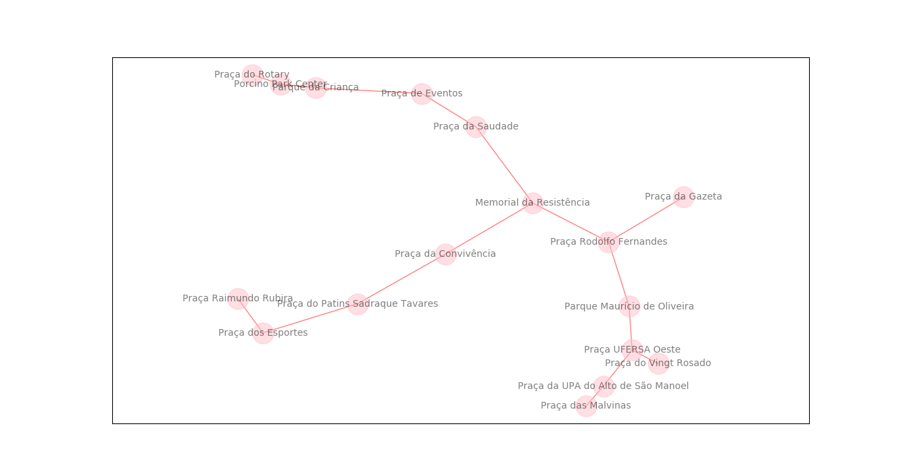

# Networkx From KML


Networkx From KML é um(a) `exemplo` de como `plotar figuras` para criar `grafos` utilizando locais no google maps.

Para esse exemplo foi utilzado uma lista de praças da cidade de Mossoró/RN obtidos no google maps. O objetivo desse projeto é plotar um grafo de distâncias entre as praças/parques utilizando as informações de latitude e longitude presentes no arquivo KML.


## Pré-requisitos

Antes de começar, verifique se você atendeu aos seguintes requisitos:
* A sua versão do python é superior ou igual ao `python3`?
* Você possui alguma versão do `virtualenv` compatível com o `python3`?

## Instalando Networkx-From-KML

Para instalar o , siga estes passos:

```shell
git clone https://github.com/HerlanAssis/Networkx-From-KML;
cd Networkx-From-KML;
```

Crie e ative o seu ambiente virtual e depois execute:

```shell
pip install -r requirements.txt
```

## Utilizando Networkx-From-KML

Para usar o Networkx-From-KML, siga estes passos:

```shell
python main.py
```

Resultado:


## TODO

As próximas ações para o Networkx-From-KML são:

* [x] ~~Escrever README~~
* [ ] Transformar o código em uma biblioteca para uso rápido

## Contribuindo para Networkx-From-KML

Para contribuir com Networkx-From-KML, siga estes passos:

1. Fork esse repositório.
2. Crie uma branch: `git checkout -b <branch_name>`.
3. Faça suas mudanças e comite para: `git commit -m '<commit_message>'`
4. Push para a branch de origem: `git push origin Networkx-From-KML/<location>`
5. crie um pull request.

## Contribuidores

Agradeço às seguintes pessoas que contribuíram para este projeto:

* [@herlanassis](https://github.com/herlanassis)

## Contato

Se você quiser entrar em contato comigo, entre em contato com herlanassis@gmail.com.

## License
Este projeto usa a seguinte licença: [Apache 2.0](https://choosealicense.com/licenses/apache-2.0/#).
